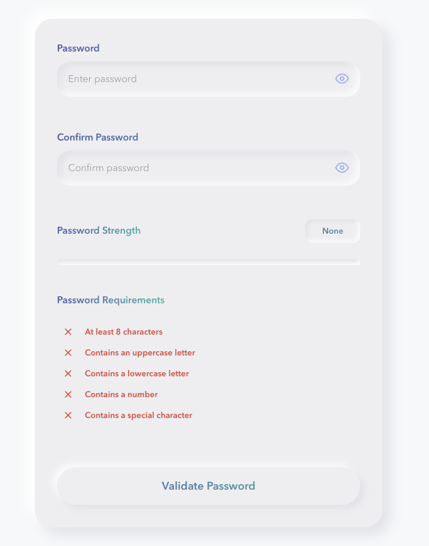
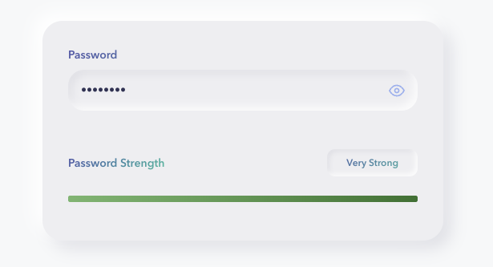
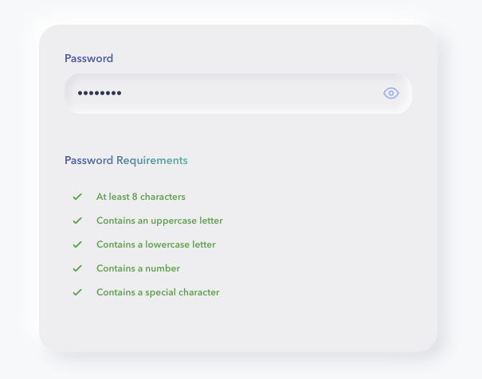

<div align="center">
  

  <h1>Password Validation Library</h1>

  <p>
    
    
    
  </p>
  <p>
    
    
    
  </p>
</div>

## ✨ Key Features

The Password Validation library offers a comprehensive set of features designed to enhance security while providing an excellent user experience. Our component-based architecture allows for flexible integration into any React application, with a focus on both functionality and aesthetics.

Explore the following key features that set our password validation solution apart:

<table>
<tr>
  <td width="50%">
    <h3>🔄 Real-time Validation</h3>
    <p>Instant feedback as users type, highlighting password strength and requirements</p>
  </td>
  <td width="50%">
    <h3>🔒 Comprehensive Rules</h3>
    <p>Enforces strong password policies including length, character variety, and pattern detection</p>
  </td>
</tr>
<tr>
  <td width="50%">
    <h3>🎨 Customizable UI</h3>
    <p>Fully customizable components with neumorphic design and modern aesthetics</p>
  </td>
  <td width="50%">
    <h3>♿ Accessibility</h3>
    <p>ARIA-compliant components ensuring all users can interact effectively</p>
  </td>
</tr>
<tr>
  <td width="50%">
    <h3>📱 Responsive Design</h3>
    <p>Adapts seamlessly to all screen sizes and devices</p>
  </td>
  <td width="50%">
    <h3>🔍 TypeScript Support</h3>
    <p>Full TypeScript definitions for enhanced developer experience</p>
  </td>
</tr>
</table>

## 🚀 Getting Started

### Prerequisites
- Node.js (v18.x or later)
- npm (v9.x or later)

### Local Development
1. Clone the repository
```bash
git clone https://github.com/yourusername/password-validator.git
cd password-validator
```

2. Install dependencies
```bash
npm install
```

## 📦 Available Scripts

In the project directory, you can run the following scripts:

| Script | Description |
|--------|-------------|
| `npm run dev` | Starts the development server using Vite |
| `npm run build` | Builds the project for production |
| `npm run preview` | Serves the production build locally |
| `npm run test` | Runs unit and integration tests |
| `npm run test:e2e` | Runs end-to-end Playwright tests |
| `npm run lint` | Runs ESLint to check code quality |
| `npm run format` | Formats code using Prettier |
| `npm run storybook` | Starts Storybook for component development |
| `npm run build-storybook` | Builds Storybook for static deployment |

## Usage

Implementing the Password Validator in your React application is simple and requires minimal configuration. The component handles all validation logic internally, providing a complete solution that works out of the box while remaining customizable for your specific needs.

The following example demonstrates how to integrate the PasswordValidator component into your application and handle the validated data:

```tsx
import { PasswordValidator } from "components/PasswordValidator";

const App = () => {
  const handleSubmit = (data) => {
    console.log("Valid password submitted:", data);
    // Process the validated password data
  };

  return (
    <div className="app">
      <h1>Create Account</h1>
      <PasswordValidator onSubmit={handleSubmit} />
    </div>
  );
};

export default App;
```

## 🛠️ Technologies

The Password Validation library is built on a foundation of modern, robust technologies that ensure reliability, performance, and maintainability. We've carefully selected each technology to create a seamless development experience while providing end-users with a secure and intuitive interface.

<table>
<tr>
  <td width="33%" align="center">
    
    <h3>React</h3>
    <p>A JavaScript library for building user interfaces</p>
  </td>
  <td width="33%" align="center">
    
    <h3>TypeScript</h3>
    <p>Adds static typing to JavaScript for better developer experience</p>
  </td>
  <td width="33%" align="center">
    
    <h3>Styled Components</h3>
    <p>CSS-in-JS library for component-based styling</p>
  </td>
</tr>
<tr>
  <td width="33%" align="center">
    
    <h3>Zod</h3>
    <p>TypeScript-first schema validation with static type inference</p>
  </td>
  <td width="33%" align="center">
    
    <h3>React Hook Form</h3>
    <p>Performant, flexible form validation library</p>
  </td>
  <td width="33%" align="center">
    
    <h3>Vite</h3>
    <p>Next generation frontend tooling for fast development</p>
  </td>
</tr>
</table>

## 🔗 Components

The Password Validation library follows a modular component-based architecture, allowing you to use either the complete solution or individual components based on your specific requirements. Each component is designed with reusability and customization in mind, while maintaining a consistent neumorphic design language.

<table>
<tr>
  <td>
    <h3 align="center">🔐 PasswordValidator</h3>
    <p align="center"></p>
    <p>The main component that provides a complete password validation form with real-time feedback and comprehensive validation rules. This component integrates all the validation logic, UI elements, and form handling into a single, easy-to-use solution.</p>
    <p>The PasswordValidator uses React Hook Form for efficient form state management and Zod for schema validation, ensuring that passwords meet security requirements while providing immediate feedback to users. The component handles password matching, strength assessment, and submission logic, making it ideal for registration forms, password reset flows, and account management interfaces.</p>
  </td>
</tr>
<tr>
  <td>
    <h3 align="center">📈 PasswordStrengthIndicator</h3>
    <p align="center"></p>
    <p>A dynamic component that visually indicates the strength of a password through color-coded feedback and progress indicators. This component analyzes password complexity in real-time and provides users with immediate visual feedback about their password's security level.</p>
    <p>The PasswordStrengthIndicator evaluates multiple factors including length, character variety (uppercase, lowercase, numbers, special characters), and common patterns to determine password strength. The intuitive color scale ranges from red (weak) to green (strong), helping users understand how to improve their password security without overwhelming them with technical details.</p>
  </td>
</tr>
<tr>
  <td>
    <h3 align="center">✅ PasswordRules</h3>
    <p align="center"></p>
    <p>A comprehensive component that displays password validation rules with real-time status indicators as users type. This component provides clear guidance on password requirements, helping users create secure passwords that meet all necessary criteria.</p>
    <p>The PasswordRules component visually tracks each validation rule (minimum length, uppercase, lowercase, numbers, special characters) with checkmarks or X marks, making it immediately clear which requirements have been satisfied and which still need attention. This interactive feedback significantly improves the user experience during account creation or password changes by reducing frustration and providing clear direction.</p>
  </td>
</tr>
</table>

## 🧪 Testing

### Unit & Integration Tests
We use Jest for unit and integration testing. Run tests with:
```bash
npm run test
```

### End-to-End Tests
We use Playwright for end-to-end testing. Run E2E tests with:
```bash
npm run test:e2e
```

## 📘 Storybook

Explore our component library and design system in Storybook. Start Storybook with:
```bash
npm run storybook
```

This will open an interactive development environment where you can view and interact with individual components in isolation.

## 💡 Best Practices

Implementing secure password validation is crucial for protecting user accounts and sensitive data. The following best practices will help you maximize the effectiveness of the Password Validator component while providing an excellent user experience.

<table>
<tr>
  <td width="50%">
    <div align="center">
      <h3>💬 Provide Feedback</h3>
      <p>Always use both the <code>PasswordRules</code> and <code>PasswordStrengthIndicator</code> components to give users clear feedback about their password strength and validity.</p>
    </div>
  </td>
  <td width="50%">
    <div align="center">
      <h3>🔧 Custom Validation</h3>
      <p>Extend the validation by modifying the schema in <code>utils/validation.ts</code> to add your own custom rules or requirements.</p>
    </div>
  </td>
</tr>
<tr>
  <td width="50%">
    <div align="center">
      <h3>♿ Accessibility</h3>
      <p>The components are built with accessibility in mind, using proper ARIA attributes and keyboard navigation. Always maintain these features when customizing.</p>
    </div>
  </td>
  <td width="50%">
    <div align="center">
      <h3>📱 Responsive Design</h3>
      <p>The components are responsive and work well on all screen sizes. Test your implementation on various devices to ensure a consistent experience.</p>
    </div>
  </td>
</tr>
<tr>
  <td width="50%">
    <div align="center">
      <h3>✉️ Error Messaging</h3>
      <p>Provide clear, actionable error messages that guide users on how to correct their password. Avoid technical jargon and focus on simple instructions.</p>
    </div>
  </td>
  <td width="50%">
    <div align="center">
      <h3>🔐 Security First</h3>
      <p>Never compromise on security requirements. Use the built-in validation rules as a baseline and add more stringent rules for high-security applications.</p>
    </div>
  </td>
</tr>
</table>

## 🌐 Environment Support

The Password Validation library is designed to work across a wide range of environments and platforms, ensuring compatibility with various browsers, devices, and React versions.

<table>
<tr>
  <td width="20%" align="center">
    <h3>🌎 Browsers</h3>
    <p>Chrome, Firefox, Safari, Edge (latest 2 versions)</p>
  </td>
  <td width="20%" align="center">
    <h3>⚛️ React</h3>
    <p>Compatible with React 16.8+ (requires Hooks support)</p>
  </td>
  <td width="20%" align="center">
    <h3>📱 Mobile</h3>
    <p>Fully responsive design works on iOS and Android devices</p>
  </td>
  <td width="20%" align="center">
    <h3>🖥️ SSR</h3>
    <p>Compatible with Next.js and other SSR frameworks</p>
  </td>
  <td width="20%" align="center">
    <h3>👷‍♂️ TypeScript</h3>
    <p>Written in TypeScript with full type definitions</p>
  </td>
</tr>
</table>

## License

MIT
